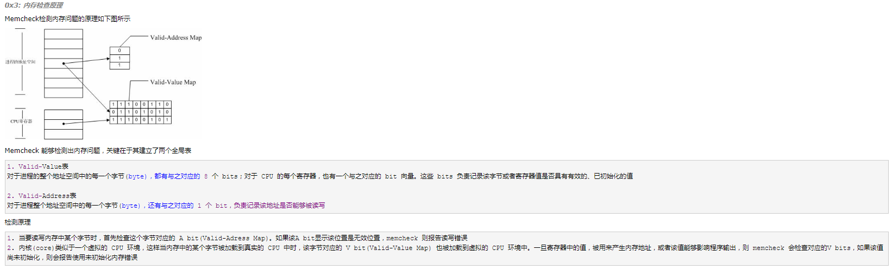
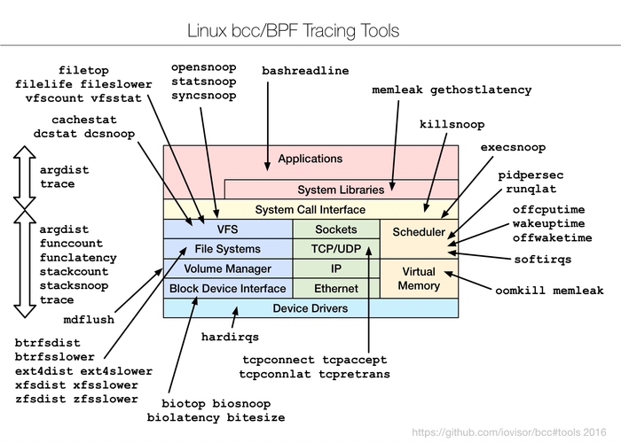
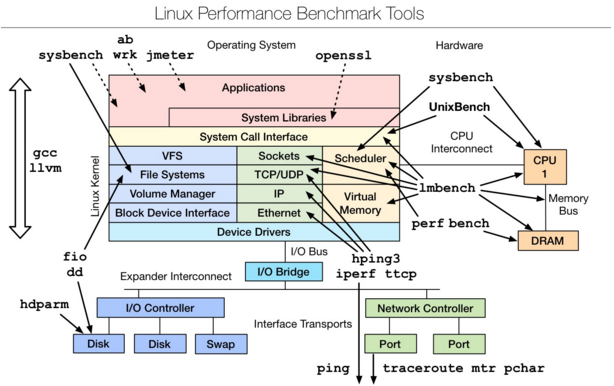

## 各种debug工具

### 常见工具介绍参考
>1，https://www.howtoing.com/command-line-tools-to-monitor-linux-performance/             

### Valgrind
>1,命令使用：valgrind --leak-check=full --show-reachable=yes --trace-children=yes --track-origins=yes  ./sspersonal 2>val_checkmem.log
>2,包含工具一：Memcheck：一个重量级的内存检查器，能够发现开发中绝大多数内存错误使用情况
>3,包含工具二：Callgrind：主要用来检查程序中函数调用过程中出现的问题
>4,包含工具三：Cachegrind：主要用来检查程序中缓存使用出现的问题
>5,包含工具四：Helgrind：主要用来检查多线程程序中出现的竞争问题
>6,包含工具五：Massif：主要用来检查程序中堆栈使用中出现的问题
>7,包含工具六：Extension:可以利用core提供的功能，自己编写特定的内存调试工具

### memcheck原理--还不太懂

### 常用的内存泄漏检测工具

#### C/C++
>1. Valgrind: Debugging and profiling Linux programs, aiming at programs written in C and C++            
>2. ccmalloc: Linux和Solaris下对C和C++程序的简单的使用内存泄漏和malloc调试库          
>3. LeakTracer: Linux、Solaris和HP-UX下跟踪和分析C++程序中的内存泄漏       
>4. Electric Fence: Linux分发版中由Bruce Perens编写的malloc()调试库        
>5. Leaky: Linux下检测内存泄漏的程序      
>6. Dmalloc: Debug Malloc Library       
>7. MEMWATCH: 由Johan Lindh编写，是一个开放源代码C语言内存错误检测工具，主要是通过gcc的precessor来进行         
>8. KCachegrind: A visualization tool for the profiling data generated by Cachegrind and Calltree          

#### JAVA
>1. Memory Analyzer: 是一款开源的JAVA内存分析软件，查找内存泄漏，能容易找到大块内存并验证谁在一直占用它，它是基于Eclipse RCP(Rich Client Platform)，可以下载RCP的独立版本或者Eclipse的插件                
>2. JProbe: 分析Java的内存泄漏       
>3. JProfiler: 一个全功能的Java剖析工具，专用于分析J2SE和J2EE应用程序。它把CPU、执行绪和内存的剖析组合在一个强大的应用中，GUI可以找到效能瓶颈、抓出内存泄漏、并解决执行绪的问题    
>4. JRockit: 用来诊断Java内存泄漏并指出根本原因，专门针对Intel平台并得到优化，能在Intel硬件上获得最高的性能                       
>5. YourKit .NET & Java Profiling: 业界领先的Java和.NET程序性能分析工具           
>6. AutomatedQA: AutomatedQA的获奖产品performance profiling和memory debugging工具集的下一代替换产品，支持Microsoft, Borland, Intel, Compaq 和 GNU编译器。可以为.NET和Windows程序生成全面细致的报告，从而帮助您轻松隔离并排除代码中含有的性能问题和内存/资源泄露问题。支持.Net 1.0,1.1,2.0,3.0和Windows 32/64位应用程序          
>7. Compuware DevPartner Java Edition: 包含Java内存检测，代码覆盖率测试，代码性能测试，线程死锁，分布式应用等几大功能模块   

### BCC / BPF - 用于Linux性能监视的动态跟踪工具
>1，参考链接：https://linux.cn/article-9139-1.html          

### Linux observability tools | Linux 性能观测工具
>1，参考链接：http://rdc.hundsun.com/portal/article/731.html  和http://www.open-open.com/lib/view/open1434589043973.html         
>2，uptime、top(htop)、mpstat、isstat、vmstat、free、ping、nicstat、dstat   
>3，sar、netstat、pidstat、strace、tcpdump、blktrace、iotop、slabtop、sysctl、/proc         

### Linux benchmarking tools | Linux 性能测评工具
>1，参考链接：http://rdc.hundsun.com/portal/article/731.html           

### Linux tuning tools | Linux 性能调优工具

### Linux observability sar | Linux 性能观测工具

### Linux系统监控神器--Collectl
>1，参考链接：https://linux.cn/article-2830-1.html      
>2，性能监视工具，用于收集有关系统资源的信息，例如cpu，磁盘，内存，网络，inode，nfs，进程等        

### perf top -p pid

### strace -o out.txt  -f -t -c -e trace=all -p PID

### 内存错误现象与原因
>1，参考：https://www.ibm.com/developerworks/cn/aix/library/au-memorytechniques.html 觉得很不错，讲的一些编程上的问题    

### vmstat
>1，vmstat测量上下文切换次数，cs表示

### jstack
>1，查看线程情况