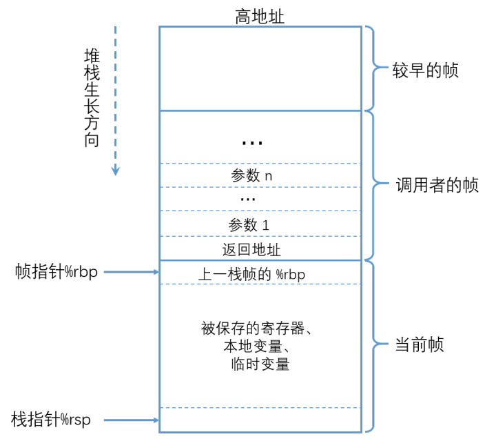
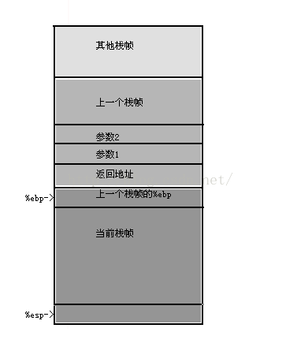

## 堆栈信息

### 参考信息
>1，堆栈介绍，很不错：https://zhuanlan.zhihu.com/p/27339191
>2，GDB 教程：https://wizardforcel.gitbooks.io/100-gdb-tips/print-registers.html

### 堆栈信息

### gdb调试用例-看寄存器信息
>1，gdb ./logic_test core.17116
>2，bt
>3，i r
>4，x $rsp     得到0x7f321ff27f20
>5，x/32d 0x7f321ff27f20